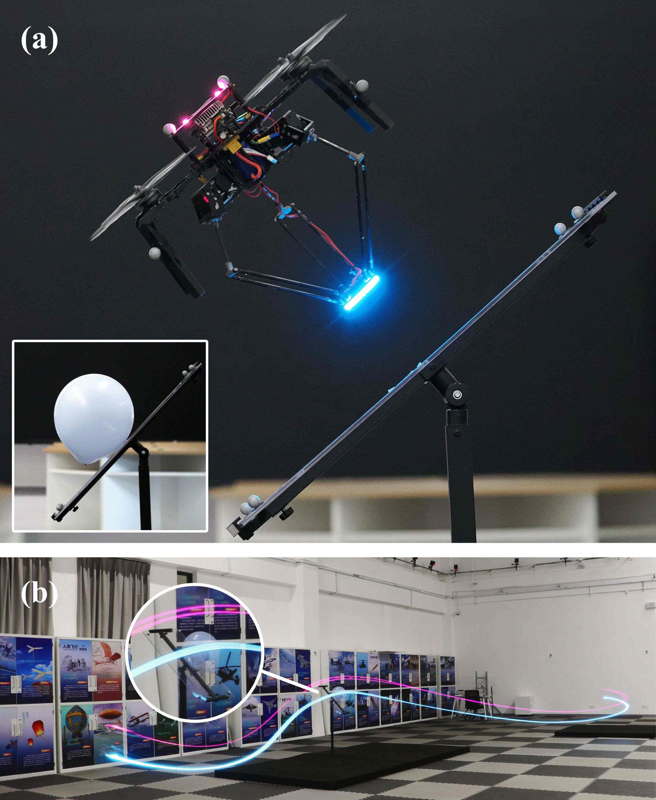

# Whole-Body Integrated Motion Planning for Aerial Manipulators


[](https://arxiv.org/abs/2501.06493)
[](https://www.bilibili.com/video/BV1pxcHebEqr?vd_source=3bacea077de525a48604ad1df69038ed)
[](https://github.com/am-planner.github.io)

<div align="center">
    <a href="https://www.bilibili.com/video/BV1pxcHebEqr/?spm_id_from=333.1387.homepage.video_card.click&vd_source=d450cee11e9b588cf172b8ee1b211101" target="_blank">
    
    </a>
</div>

## News🔥

**[2025.9.26]** Paper accepted by *IEEE Transactions on Robotics (T-RO)* 🚀🎉

**[2025.12.6]** 🚩 Code released! Find the source in the [`am-planner`](https://github.com/SYSU-HILAB/am-planner) repository.

## Main Contributors

[Weiliang Deng（邓伟亮）](https://dwl2021.github.io)  [Hongming Chen（陈鸿铭）](https://xiaodao-chen.github.io) 


## 1. Overview

AM-Planner is a novel whole-body integrated motion planning framework for quadrotor-based aerial manipulators that enables versatile manipulation capabilities through flexible waypoint constraints. Our framework simultaneously optimizes trajectories for both the quadrotor and manipulator to achieve coordinated whole-body motion across a wide range of manipulation tasks.

### 1.1 Key Features

- **Whole-body Planning**: Simultaneous optimization of quadrotor and manipulator trajectories
- **Flexible Waypoint Constraints**: Selective specification of position, velocity, or orientation requirements
- **IL-Guided Optimization**: Imitation learning to overcome poor local optima in challenging scenarios
- **Collision-Free Manipulation**: Novel varying ellipsoid method for dynamic collision avoidance

## 2. Installation

### 2.1 Prerequisites

- **ROS Noetic** (Recommended!)
- Python 3.8
- CUDA (for GPU acceleration)

### 2.2 Setup Environment

```bash
# Create conda environment
conda env create -n am python==3.8
conda activate am

# Install dependencies
conda install conda-forge::autodiff
pip install -r requirements.txt

# Install ROS dependencies
sudo apt-get install ros-${ROS_DISTRO}-vrpn* \
   ros-${ROS_DISTRO}-mavros \
   ros-${ROS_DISTRO}-octomap-ros \
   pybind11-dev python3-pybind11
```

### 2.3 Setup Polynomial_DiT

```bash
# Create directory and clone repository
mkdir dit && cd dit
git clone https://github.com/Dwl2021/Polynomial_DiT.git
cd Polynomial_DiT/checkpoints

# Download pretrained models
python3 download.py
```

### 2.4 Build the Project

```bash
catkin build
```

## 3. Quick Start

### 3.1 Basic Usage

```bash
# Setup environment
./shfiles/setup.sh

# Run basic planning
conda activate am
./shfiles/run.sh  # Contains 3 different options, please refer to the script for details
```

### 3.2 IL-Guided Optimization

```bash
# Setup environment
./shfiles/setup.sh

# Run with imitation learning guidance
conda activate am
./shfiles/il.sh
```

## 4. Configuration

### 4.1 Task Selection

Modify the task in `src/plan/plan_manage/launch/run_in_sim_other.launch`:

```xml
<arg name="task" default="push" />
```

Available tasks can be found in `src/plan/plan_manage/launch/tasks.yaml`, including: `lift`, `write`, `pull` and so on.

### 4.2 Custom Waypoint Constraints

Our framework supports four types of waypoint constraints. **Note**: The first dimension always indicates the constraint type.

#### Type 0: Guide Points for Quadrotor
- **Format**: `(0, x, y, z)`
- **Usage**: Basic waypoints that the aerial manipulator must cross in world frame

#### Type 1: Fixed Points for Quadrotor
- **Format**: `(1, x, y, z, nx, ny, nz)`
- **Usage**: Position + orientation constraints where the quadrotor must cross `(x, y, z)` and align thrust vector to `(nx, ny, nz)`

#### Type 2: Soft End-Effector Constraints
- **Format**: `(2, ax, ay, az, nx, ny, nz, cn, vx, vy, vz, cvx, cvy, cvz, fixed_x, fixed_y, fixed_z)`
- **Usage**: Flexible end-effector positioning with optional velocity and orientation constraints
- **Parameters**:
  - `(ax, ay, az)`: End-effector target position in world frame
  - `(nx, ny, nz)`: Orientation vector (used if `cn = 1`)
  - `(vx, vy, vz)`: End-effector velocity constraints
  - `(cvx, cvy, cvz)`: Velocity constraint types (1=equal, 2=greater, 3=less than the specified velocity; 0 means no constraint in that direction)
    - For example: `vx = 0.1, cvx = 2` means the velocity along the x-axis should be greater than 0.1. If `cvx = 0, cvy = 0, cvz = 0`, it means there is no velocity constraint.
  - `(fixed_x, fixed_y, fixed_z)`: Planar motion constraints
    - For example: `fixed_z = 1`: End-effector motion constrained to same horizontal plane. `fixed_y = 1, fixed_z = 1`: End-effector can only move along x-axis

#### Type 3: Hard Whole-Body Constraints
- **Format**: `(3, x, y, z, bax, bay, baz, nx, ny, nz, cn, vx, vy, vz, cvx, cvy, cvz, fixed_x, fixed_y, fixed_z)`
- **Usage**: High-precision constraints combining quadrotor world position with end-effector body-frame positioning
- **Parameters**: Similar to Type 2, with additional body-frame end-effector position `(bax, bay, baz)`
- **Note**: Suitable for tasks requiring high-precision hard constraints

## 5. Paper and Citation

If you use this work in your research, please cite our paper:

```bibtex
@ARTICLE{deng2025whole,
  author={Deng, Weiliang and Chen, Hongming and Ye, Biyu and Chen, Haoran and Li, Ziliang and Lyu, Ximin},
  journal={IEEE Transactions on Robotics}, 
  title={Whole-Body Integrated Motion Planning for Aerial Manipulators}, 
  year={2025},
  volume={41},
  number={},
  pages={6661-6679},
  keywords={Trajectory;Optimization;Planning;Quadrotors;Manipulator dynamics;End effectors;Grasping;Robot kinematics;Imitation learning;Vectors;Aerial manipulator (AM);collision avoidance;delta arm;motion planning;waypoint constraint},
  doi={10.1109/TRO.2025.3626619}
}

@INPROCEEDINGS{chen2025aerial,
  author={Chen, Haoran and Deng, Weiliang and Ye, Biyu and Xiong, Yifan and Pan, Zongliang and Lyu, Ximin},
  booktitle={2025 IEEE/RSJ International Conference on Intelligent Robots and Systems (IROS)}, 
  title={Aerial Grasping via Maximizing Delta-Arm Workspace Utilization}, 
  year={2025},
  volume={},
  number={},
  pages={12216-12223},
  keywords={Kinematics;Grasping;Manipulators;Stability analysis;Real-time systems;Trajectory;Planning;Optimization;Residual neural networks;Quadrotors},
  doi={10.1109/IROS60139.2025.11247296}
}

```

## 6. Acknowledgments

We thank the following open-source projects that made this work possible:

- [Fast-Racing](https://github.com/ZJU-FAST-Lab/Fast-Racing.git)
- [GCOPTER](https://github.com/ZJU-FAST-Lab/GCOPTER.git)
- [LBFGS-Lite](https://github.com/ZJU-FAST-Lab/LBFGS-Lite.git)
- [autodiff](https://github.com/autodiff/autodiff): Used for automatic differentiation and optimization in trajectory generation and model learning


We also thank Weichen Lyu (THU), Jiarui Ouyang (HKUST), and Binpei Luo (SYSU) for their valuable assistance and continuous encouragement throughout this project.

## 7. License

This project is licensed under the MIT License - see the [LICENSE](LICENSE) file for details.

## 8. Contact

For questions or issues, please open an issue on GitHub or contact us at dengwliang [at] mail2.sysu.edu.cn.